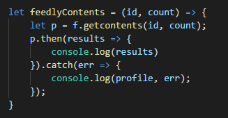

### 博客爬虫
> 博客爬虫的特点在于通过RSS来获取内容。

> 此篇实例我们用到了feedly来解析RSS的内容。

## API
* [feedly.com](https://developer.feedly.com/v3/streams/)
* [feedly id && screct获取的方法](https://groups.google.com/forum/#!forum/feedly-cloud)

> 测试用例
* [test link](http://cloud.feedly.com/v3/streams/contents?streamId=feed/https://blogs.msdn.microsoft.com/rss/&count=300)

## 分析爬虫过程

> 需求：根据一个bog 的 URL 地址进行爬虫（[示例URL](https://www.rickvanrousselt.com/about-me/)）

> 已知问题：

* URL重定向（[解决方案](https://www.npmjs.com/package/request-promise)）
* RSS URL重定向
* RSS URL需补全
* 页面不存在
* 本身RSS内容为空
* 找不到RSS URL

> 开始分析

* 第一步：
    * 请求 URL , URL是否重定向, URL是否404，503
    * 拿到 HTML 
    * 

* 第二步：
    * 操作 HTML DOM ([cheerio](https://www.npmjs.com/package/cheerio))
    * 分析可以拿到RSS链接的可能性
    * 
    * 如果在页面上找不到RSS URL，可以通过RSS的通用规则来拼接出可能会成功的RSS URL
    * 

    * 测试用例:
        * [rssXml](http://www.ideliverable.com/blog)
        * [atomXml](https://www.jaredthenerd.com/)
        * [rssImg](https://geislerdatensysteme-public.sharepoint.com/Seiten/TechnikBlog.aspx)
        * [RSSImg](https://www.winthropdc.com/home.htm)
        * [feedImg](http://www.ucprimer.com/)
        * [xmlImg](http://www.tipsdbits.com/)
        * [titleRSS]()
        * [titlerss]()
        * [hrefRSS](https://mvp.microsoft.com/en-us/PublicProfile/5001225?fullName=Tony%20Christopher%20De%20Jonker)
        * [hrefrss](http://www.infoworld.com/author/Adam-Bertram/)
        * [feed](https://blogs.msdn.microsoft.com/)
        * [frame](http://blog.naver.com/kaoncloud)
        * [other](http://blog.csdn.net/shelleyliu0415)
        * [404](http://blog.wortell.nl/author/danny-bProfileLinkage)
        * [redirct](http://blog.gandjustas.ru/)

* 第三步：
    * 拿到 RSS URL
        * 重定向（[示例](http://www.dylanbeattie.net/)）
        * 需要补全（[示例](http://www.jaredthenerd.com/)）
    * 解析RSS URL
        * 利用[node-feedly](https://github.com/hildjj/node-feedly)
        * 
        * 调用 feedlyContents() 并输出;
        * 

## capture

    

